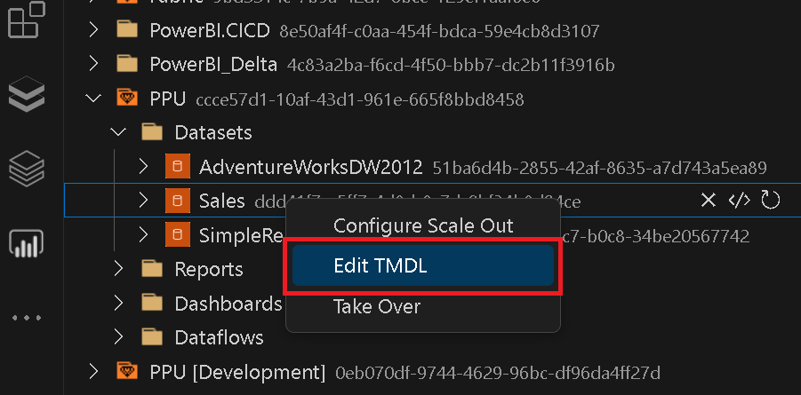
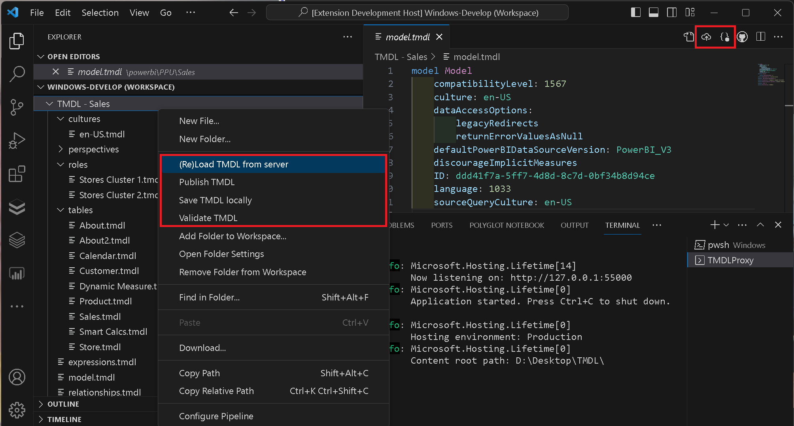
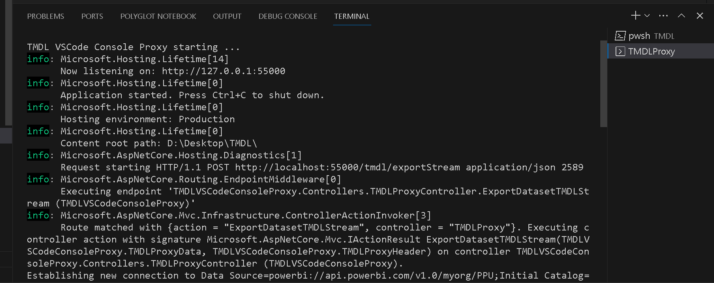

# PowerBI-VSCode
[](https://marketplace.visualstudio.com/items?itemName=GerhardBrueckl.powerbi-vscode)
[](https://marketplace.visualstudio.com/items?itemName=GerhardBrueckl.powerbi-vscode)
[](https://marketplace.visualstudio.com/items?itemName=GerhardBrueckl.powerbi-vscode)
[](https://marketplace.visualstudio.com/items?itemName=GerhardBrueckl.powerbi-vscode)


A [VSCode](https://code.visualstudio.com/) extension for managing your Power BI tenant using the [Power BI REST API](https://docs.microsoft.com/en-us/rest/api/power-bi/) and modify Power BI datasets using TMDL (Tabular Model Definition Language) from within VSCode.

# Installation
The extensions can be installed directly from within VSCode by searching for this extension (`GerhardBrueckl.powerbi-vscode`) or downloaded from the official Visual Studio Code extension gallery at [PowerBI VSCode](https://marketplace.visualstudio.com/items?itemName=GerhardBrueckl.powerbi-vscode) and installed manually as `VSIX`.

# Features
- GUI to browse your workspace and run operations like [rebind](https://learn.microsoft.com/en-us/rest/api/power-bi/reports/rebind-report-in-group), [clone](https://learn.microsoft.com/en-us/rest/api/power-bi/reports/clone-report-in-group), ...
- Modify Power BI datasets using **TMDL** - see [TMDL](#tmdl)
- Microsoft Fabric integration - see [Microsoft Fabric](#microsoft-fabric) (Preview)
- Supports VSCode and [vscode.dev](https://vscode.dev)
- Connect to remote tenants where you are invited as a guest user - see [Configuration](#configuration)
- Run DAX queries in a notebook against your Power BI Datasets using `%dax` magic
- Run arbitrary REST API calls in a notebook using `%api` magic - see [Notebooks](#notebooks)
- Drag & Drop to run certain commands (e.g. drop a report on a dataset to rebind it)
- GUI to manage Capacities, Gatways and Pipelines

# Configuration
The extension supports the following VSCode settings:

|Setting|Description|Example value|
|-------|-----------|-------------|
|`powerbi.tenantId`|(Optional) The tenant ID of the remote tenant that you want to connect to.|A GUID, `abcd1234-1234-5678-9abcd-9d1963e4b9f5`|
|`powerbi.clientId`|(Optional) A custom ClientID/Application of an AAD application to use when connecting to Power BI.|A GUID, `99887766-1234-5678-9abcd-e4b9f59d1963`|
|`powerbi.cloud`|(Optional) Only use when you want to connect to a sovereign or governmental cloud!|GlobalCloud|
|`powerbi.TMDL.clientId`|(Optional) To use **TMDL features**, a custom ClientID/Application can be used. You can use `058487e5-bde7-4aba-a5dc-2f9ac58cb668` and make sure its permitted in your tenant or you can create your own AAD application in your AAD tenant (see [README](https://github.com/gbrueckl/PowerBI-VSCode/blob/main/README.md#tmdl)) for details. If this is configured, VSCode will manage the authentication and also remember it!|A GUID, `058487e5-bde7-4aba-a5dc-2f9ac58cb668`|
|`powerbi.TMDL.enabled`|Set to `true` (default) to allow editing Power BI datasets using TMDL.|`true`(default)/`false`|
|`powerbi.Fabric.itemTypes`|(Optional) A list of [Fabric Item Types](https://learn.microsoft.com/en-us/rest/api/fabric/core/items/list-items?tabs=HTTP#itemtype) with an optional [Format](https://learn.microsoft.com/en-us/rest/api/fabric/articles/item-management/definitions/notebook-definition#supported-formats) as list of objects.|```[{"itemType": "Notebook", "format": "ipynb"}, {"itemType": "Report"}]```|
|`powerbi.workspaceFilter`|(Optional) A regex to filter workspaces by name. Only workspaces matching this regex will be shown in the Power BI Workspaces view.|`Project A\|Sales` to see only workspaces that have "Project A" or (\|) "Sales" in the name|

# Notebooks
You can open a new Power BI notebook via the UI from the header of each treeview or by running the command **Open new PowerBI Notebook** (command `PowerBI.openNewNotebook`). Power BI notebooks have the file extension `.pbinb` and will automatically open in the notebook editor.

The following features are supported by notebooks and can be used using magic tags in the first line of the cell:
- running arbitrary [REST API calls](#run-rest-api-calls-api) (magic `%api`)
- executing [DAX](#execute-dax-queries-dax) queries against a dataset (magic `%dax`)
- executing [TMSL](#execute-dax-queries-dax) statements against a dataset (requires [TMDL](#tmdl)) (magic `%tmsl`)
- setting [variables](#using-variables-cmd) to be used in subsequent cells (magic `%cmd`)

Next to the magic itself you can also specify a custom API endpoint for every cell right after the magic tag:

``` dax
%dax /groups/ccce57d1-10af-1234-1234-665f8bbd8458/datasets/51ba6d4b-1234-1234-8635-a7d743a5ea89
EVALUATE INFO.TABLES()
```

This overwrites the `API_PATH` set for the notebook to run DAX queries. You can now run multiple DAX statements against different datasets from within the same notebook without changing the `API_PATH` every time. For example if you want to run the same query against `TEST` and `PROD` to compare results etc.

Custom API endpoints work for all magics except `%cmd` which does not interact with the API at all.

For proper visualization of the results I highly recommend to also install the [Data Table Renderers extension](https://marketplace.visualstudio.com/items?itemName=RandomFractalsInc.vscode-data-table)!

## Run REST API calls (%api)
To run a REST API call from the notebook you can simply write the following:

``` rest
METHOD endpoint
{JSON-Body}
```

For example to create a new dashboard in _My Workspace_ you can run the following command:

``` rest
POST /dashboards
{
  "name": "SalesMarketing"
}
```

The JSON-body can also be omitted, e.g. for a GET request.
Supported METHODs are `GET`, `POST`, `PUT`, `PATCH` and `DELETE`. the _endpoint_ can either be absolute (e.g. `https://api.powerbi.com/v1.0/myorg/dashboards`), relative to the root of the API (e.g. `/dashboards`) or relative to the path set via notebook variables `API_ROOT_PATH` (e.g. `./refreshes`) (see [Using Variables](#using-variables-cmd) below)

## Execute DAX queries (%dax)
To run a DAX query from within the notebook, you have to use the cell magic `%dax` in the very first line of your cell. The following lines will contain the actual DAX query:

``` dax
%dax
EVALUATE MyTable
```

For this to work, you first need to set the variable `DATASET` in your notebook before - see [Using Variables](#using-variables-cmd) below.

## Using variables (%cmd)
You can also define and use variables within the notebook. To set a variable you can use

``` bash
%cmd
MY_VARIABLE = my_value
```

Please note that variable names are note case sensitive and are converted to UPPER when you define them. However, you reference them using any casing you want.

There are some special variables that must be set in combination with `%dax` magic to identify the dataset. The main variable that needs to be set is the `DATASET` (aliases are also `DATASET_PATH`, `API_PATH`or `API_ROOT_PATH`) to identify the dataset to which the DAX query is sent. the value has to be an API path pointing to the dataset:

``` bash
%cmd
SET DATASET = /groups/d1f70e51-1234-1234-8e4c-55f35f9fa758/datasets/028d20ca-7777-8888-9999-7a253c7bb6b3
```

Current values of variables can be retrieved by running `SET MY_VARIABLE`.

Variables can be used via the pattern `$(<variableName>)`. Assuming the variable `My_Variable` is set to `123`:

``` dax
EVALUATE ROW("MyVariable", $(My_Variable))
```

**Note:** you can also set/get multiple variables within the same notebook cell!

## Executing TMSL scripts (%tmsl)
The Tabular Model Scripting Language (TMSL) can be used to create or modify Tabular Models like Power BI datasets. Using the `%tmsl` magic you can now also run TMSL scripts against the current Tabular Server (Power BI Premium Workspace) as follows:

``` json
%tmsl
{   
   "alter":{   
      "object":{   
         "database":"AdventureWorksTabular1200",  
         "role":"DataReader"  
      },  
      "role":{   
         "name":"New Name"  
      }  
   }  
}  
```

While you could technically run any TMSL script including large `createOrUpdate` scripts, its purpose is to modify individual properties of selected objects like changing the name of a role etc.

# Microsoft Fabric
The extension also provides an easy way to interact with all items hosted in Microsoft Fabric. Besides the regular Power BI artifacts like Datasets and Reports this also includes Notebooks and SparkJobDefinitions (more to be added once the Fabric APIs exist!). To browse your Fabric items, you need to use [VSCode Workspace](https://code.visualstudio.com/docs/editor/workspaces) when working with VSCode. In your workspace settings file, you can add a Fabric Workspace using an URI in the format of `fabric://workspaces/<workspace-guid>`:

```json
{
	"folders": [
		{
			"path": "."
		},
		{
			"uri": "fabric://workspaces/f6fb3aea-f11f-4f06-b6fa-89bac4c0fee0",
			"name": "My Fabric Workspace"
		}
	]
}
```

Once this is set up, you can browse your Fabric items as if they were local. In fact we use the API to download them and cache them locally in memory for you. You can also add, modify or delete the whole Fabric items or its files. Locally changed files will be displayed similar to changed items in GIT:

- green with `A` badge -> Added
- yellow with `M` badge -> Modified
- red with `D` badge -> Deleted

To publish your local changes back to Fabric, right-clicking on the Item-folder (e.g the Dataset, the Report, the Notebook, ...) and select `Publish to Fabric`.

To undo your local changes or force the reload of content from Fabric (e.g. if you changed/created a new item in the Fabric UI), you can use `Reload from Fabric` from the context menu.

# TMDL

Using this extension you can modify your Power BI Datasets directly within VSCode using Tabular Model Definition Language (**TMDL**). For datasets that reside in a Premium Capacity, you can select `Edit TMDL` from the context menu:

The TMDL definition files will be added to your current workspace and you can modify them from there.
When you are done with your changes, you will find a `[Validate TMDL]` and a `[Publish TMDL]` button at the right top of your editor.


## Prerequisites
The following prerequisites have to be fulfilled to use all TMDL features:

- .NET Runtime 7 (or higher)
  - [ASP.NET Core Runtime 7.0.14 Windows Hosting Bundle](https://dotnet.microsoft.com/en-us/download/dotnet/thank-you/runtime-aspnetcore-7.0.14-windows-hosting-bundle-installer) (includes [.NET Runtime 7.0.14](https://dotnet.microsoft.com/en-us/download/dotnet/thank-you/runtime-7.0.14-windows-x64-installer) and [ASP.NET Core Runtime 7.0.14](https://dotnet.microsoft.com/en-us/download/dotnet/thank-you/runtime-aspnetcore-7.0.14-windows-x64-installer) for x64 and x86)
  - [.NET Desktop Runtime 7.0.14 x64](windowsdesktop-runtime-7.0.14-win-x64.exe) (or [x86](https://dotnet.microsoft.com/en-us/download/dotnet/thank-you/runtime-desktop-7.0.14-windows-x86-installer))
  - alternatively you might want to install the [.NET SDK 7.0 x64](https://dotnet.microsoft.com/en-us/download/dotnet/thank-you/sdk-7.0.404-windows-x64-installer) (or [x86](https://dotnet.microsoft.com/en-us/download/dotnet/thank-you/sdk-7.0.404-windows-x86-installer))
- make sure that the VSCode Setting `powerbi.TMDL.enabled` is set to `true` (=default)
- the dataset must reside in a Premium Capacity
- (optionally) you can also use VSCode to manage the authentication as it already happens for the rest of this extension. This has the advantage, that you will not be prompted every time you open VSCode. To use VSCode authenticaiton, make sure that the VSCode Setting `powerbi.TMDL.clientId` is set to either `058487e5-bde7-4aba-a5dc-2f9ac58cb668` or a custom AAD Application configured as described below:
  - Redirect URIs for Mobile and desktop applications: `https://vscode.dev/redirect`
  - Delegated Permissions: `Workspace.Read.All`, `Dataset.Read.All`, `Dataset.ReadWrite.All`
  - Consent granted for the permissions above
- technically you can also use the same ClientID also for `powerbi.clientId`. In that case please make sure that you also provide additional permissions to e.g. read reports (`Report.Read.All`), etc.

## TMDL Configuration
The setting `powerbi.TMDL.enabled` can be ued to enable or disable all TMDL features.

The setting `powerbi.TMDL.clientId` can be used to specify a custom ClientID/ApplicationID (details see above) of an Azure Active Directory Application that will be used when communicating via with the XMLA interface. By doing so, VSCode will manage the authentication for you and prompt for your credentials. Those credentials will then be remembered and stored in VSCode and you will not be prompted again every time you open VSCode.

## Using TMDL Editor
The TMDL Editor loads the TMDL definitions directly from a server and exposes them via the custom URI scheme `tmdl:/`. This allows you to add as many models as you want to your workspace to quickly access them. This is the very same that happens if you click `Edit TMDL` in the context menu of a Power BI dataset - it will add the folder `tmdl:/powerbi/<workspace>/<dataset>` to your VSCode workspace and load th model.
Alternatively, you can also omit the `/<dataset>`. In this case, a list of all available databases(=datasets) within the workspace `tmdl:/powerbi/<workspace>` will be shown and you can drill into the datasets from there.

To reload the latest definition from the server again, you can right-click the folder of the dataset in the VSCode File Explorer and select `[(Re)Load TMDL from Server]` (see screenshot above).

You can also open a TMDL folder structure that resides on your local disk already and `Validate` or `Deploy` it. Please see also below.

## Integration with other TMDL Tools
TMDL is a standard defined by Microsoft which also means that different tools can be used to work with the TMDL files. Whenever you open a `.tmdl` file, you have the option to `Validate` the whole TMDL folder structure or to `Deploy` it as a new semantic model or update/overwrite an existing one. This can be very useful to copy datasets between workspaces without down-/uploading `.pbix` files or if you have modified the dataset via the XMLA endpoint with an other tool (e.g. Tabular Editor) before.

## TMDL Proxy
This extensions leverages existing libraries for TMDL which are available as .net Core package: [Microsoft.AnalysisServices.NetCore.retail.amd64](https://www.nuget.org/packages/Microsoft.AnalysisServices.NetCore.retail.amd64). However, as this package cannot be directly integrated into VSCode which uses JavaScript/TypeScript (and not .net), we implemented a .net Core application/api that acts as a proxy between VSCode and the target Tabular Server (e.g. Power BI dataset). This allows our VSCode extension to communicate with the target from within VSCode without having to implement the library in JavaScript/TypeScript.

As soon as you start using TMDL features, this proxy process will be started automatically in the background within a VSCode terminal:



The terminal also serves as a log which shows all individual requests sent to the proxy.

# Building Locally
1. Make sure you have installed [NodeJS](https://nodejs.org/en/) on your development workstation
2. Clone this repo to your development workstation, then open the cloned folder in [VSCode](https://code.visualstudio.com/)
3. Install Visual Studio Code Extension Manager by running `npm install @vscode/vsce -g --force`
4. To install all dependencies, switch to the terminal and run `npm install`
5. To run the extension in debug mode (for using break-points, etc.), press `F5`
6. To generate the `.vsix`, switch to the terminal and run `vsce package`

# VSCode Extension Development Details
Please refer to the [official docs and samples](https://github.com/microsoft/vscode-extension-samples#prerequisites)

# FAQ

**Q: I have so many workspaces and its hard to find the one I need, what can I do?**

**A:** Every treeview (like the Power BI Workspace Browser) in VSCode is searchable by default. Simply click into the treeview and press `CTRL + F` as you would do in any other application to start a search

**Q: I have a guest account in a remote client, can I still use this extension?**

**A:** Yes! The only thing you need to do is to specify the TenantID of the remote tenant in the setting `powerbi.tenantId`. I would recommend to create a separate VSCode workspace in this scenario and change the setting there.

**Q: I tried to query the [Admin-APIs](https://learn.microsoft.com/en-us/rest/api/power-bi/admin) in a notebook but its not working, any ideas why?**

**A:** By default, this is not supported as the VSCode built-in authentication does not have the necessary permissions/scopes to read these APIs (`Tenant.Read.All` or `Tenant.ReadWrite.All`). To be able to query the Admin APIs you need to use a custom ClientID (settig `powerbi.clientId`) and add those permissions to your custom AAD application (also see [Prerequisites](#prerequisites) on how to configure a custom AAD application to be used with this extension).

**Q: I tried to run a command from the context menue but the dropdown that appears does not contain the values I want to use. What can I do?**

**A:** Unfortunately VSCode is quite limited in the way how users can enter data (e.g. a dropdown box) and we simply display the last 10 items that the user selected or expanded. So if you e.g. want to do a rebind of a report and the target dataset does not show up, please make sure to select/click it the Workspace Browser just before you run the rebind.

**Q: I am using the TMDL features and VSCode keeps prompting me for credentials over and over again. What can I do?**

**A:** This is by design, basically the very same way how also other tools like Tabular Editor or DAX Studio work. This authentication process happens within the [TMDL Proxy](#tmdl-proxy). However, you can also hand over the authentication to VSCode which would then also store your credentials in the system's key chain. All you need to do is to create a custom AAD application and specify the ClientID/ApplicationID in `powerbi.TMDL.clientId` (also see [Prerequisites](#prerequisites)).

**Q: Something went wrong or the extension is stuck, what can I do?**

**A:** Unfortunately this can happen, sorry! Please try to restart VSCode or run the command `PowerBI.initialize` from the command menu. If the problem persists, please open an [issue](https://github.com/gbrueckl/PowerBI-VSCode/issues) at our Git Repository.
